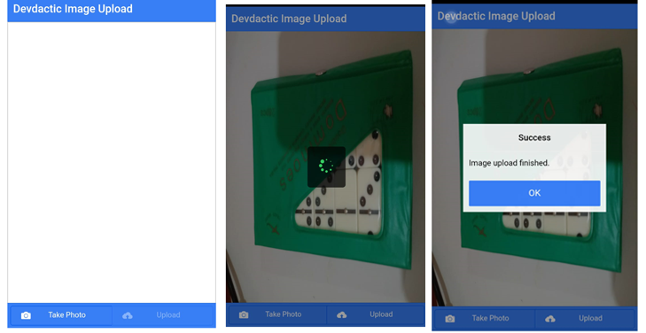

# SalvarFotosServidor
Salvando fotos no banco de dados com ionic e php

## Código já vindo da internet

Fiz algumas melhorias e estou compartilhando com todos. Agora com gravação no servidor com php e spinner para mostrar que a foto está sendo carregada.

## Os arquivos php

Os arquivos que fiz estão na pasta php, dentro de www

## Testado

Tudo foi testado com Android e emulando direto no celular

## Provedor

Lembre-se de dar permissão para gravação de fotos no provedor

